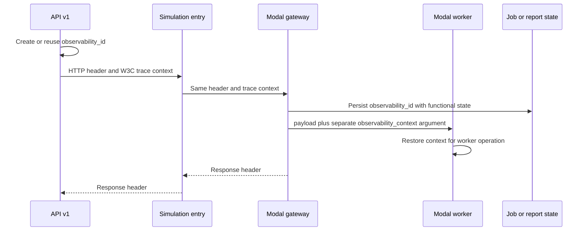
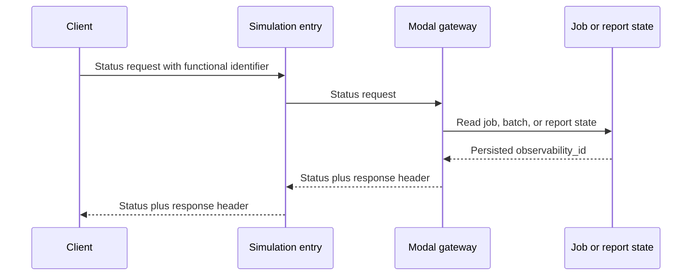

# API v1 simulation observability

This document describes the correlation and trace path shared by API v1, the
Cloud Run simulation entry service, the Modal gateway, and Modal workers.

## Submission path

When API v1 is absent, the simulation entry service creates the identifier. A
direct call to the Modal gateway causes the gateway to create it. Every service
preserves a valid value received from the service that accepted the report.

## Poll path

The stored identifier is authoritative during polling. A conflicting header on
a status request is ignored. A missing or null stored value produces no
observability response header.

## Stage 12

The simulation entry service dispatches the current production run and the
Stage 12 report with the same `observability_id`. Stage 12 creates separate
functional identifiers for the report and its baseline and reform simulations.
The coordinator passes captured context to both simulation workers. When Stage
12 runs an eligible US national report, each simulation worker passes that same
context to 20 region-group calculation calls. Baseline and reform therefore
produce 40 region-group invocations with one `observability_id`, two
`simulation_execution_id` values, and no additional persisted simulation
records. The region-group index and cache outcome distinguish their structured
logs. When Stage 12 becomes the authoritative runner, the same report
identifier flow applies; only the selected functional result changes.

## Query model

Use `observability_id` to select logs and spans for one calculation or report.
Use the stage names from `RUN_STAGE_REGISTRY` to measure individual operations.
Use `job_id`, `batch_job_id`, `evaluation_id`, and
`simulation_execution_id` to locate functional state.

Submission work can form one distributed trace because HTTP and Modal dispatch
carry W3C trace context. Status requests occur later and create separate traces
that remain queryable through the same `observability_id`.
